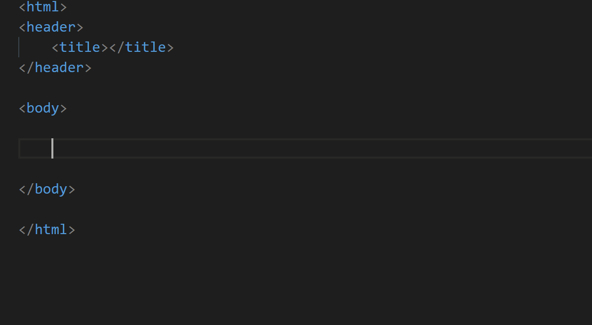

## HTML / JSX Class Attribute Snippets
This extension enables you to create HTML and JSX tags with class attributes quickly and easily.

### How-To
In order to use the snippets, begin typing one of the snippets listed below then press tab or enter.

### HTML Snippets
| Snippet | Purpose |
| :--- | :--- |
| a.class | Create an anchor with class attribute(s) |
| b.class | Create bold text with class attribute(s) |
| body.class | Create a body with class attribute(s) |
| button.class | Create a button with class attribute(s) |
| div.class | Create a section with class attribute(s) |
| dl.class | Create a description list with class attribute(s) |
| dt.class | Create a term in a description list with class attribute(s) |
| em.class | Create emphasized text with class attribute(s) |
| footer.class | Create a footer with class attribute(s) |
| form.class | Create an input form with class attribute(s) |
| h1.class | Create a heading (h1) with class attribute(s) |
| h2.class | Create a heading (h2) with class attribute(s) |
| h3.class | Create a heading (h3) with class attribute(s) |
| h4.class | Create a heading (h4) with class attribute(s) |
| h5.class | Create a heading (h5) with class attribute(s) |
| h6.class | Create a heading (h6) with class attribute(s) |
| header.class | Create a header with class attribute(s) |
| html.class | Create an html with class attribute(s) |
| idiv.class | Create an inline section with class attribute(s) |
| input.class | Create an input with class attribute(s) |
| label.class | Create a label for an input with class attribute(s) |
| li.class | Create a list item with class attribute(s) |
| nav.class | Create a nav with class attribute(s) |
| ol.class | Create an ordered list with class attribute(s) |
| p.class | Create a paragraph with class attribute(s) |
| q.class | Create a quotation with class attribute(s) |
| select.class | Create a drop-down list with class attribute(s) |
| small.class | Create smaller text with class attribute(s) |
| span.class | Create a span with class attribute(s) |
| strong.class | Create strong text with class attribute(s) |
| sub.class | Create subscripted text with class attribute(s) |
| sup.class | Create superscripted text with class attribute(s) |
| table.class | Create a table with class attribute(s) |
| tbody.class | Create a table body with class attribute(s) |
| td.class | Create a table cell with class attribute(s) |
| textarea.class | Create a multiple line input with class attribute(s) |
| tfoot.class | Create a table footer with class attribute(s) |
| th.class | Create a table header cell with class attribute(s) |
| thead.class | Create a table header with class attribute(s) |
| title.class | Create a title with class attribute(s) |
| tr.class | Create a table row with class attribute(s) |
| u.class | Create underlined text with class attribute(s) |
| ul.class | Create an unordered list with class attribute(s) |

### JSX Snippets
| Snippet | Purpose |
| :--- | :--- |
| a.className | Create an anchor with className attribute(s) |
| b.className | Create bold text with className attribute(s) |
| body.className | Create a body with className attribute(s) |
| button.className | Create a button with className attribute(s) |
| div.className | Create a section with className attribute(s) |
| dl.className | Create a description list with className attribute(s) |
| dt.className | Create a term in a description list with className attribute(s) |
| em.className | Create emphasized text with className attribute(s) |
| footer.className | Create a footer with className attribute(s) |
| form.className | Create an input form with className attribute(s) |
| h1.className | Create a heading (h1) with className attribute(s) |
| h2.className | Create a heading (h2) with className attribute(s) |
| h3.className | Create a heading (h3) with className attribute(s) |
| h4.className | Create a heading (h4) with className attribute(s) |
| h5.className | Create a heading (h5) with className attribute(s) |
| h6.className | Create a heading (h6) with className attribute(s) |
| header.className | Create a header with className attribute(s) |
| html.className | Create an html with className attribute(s) |
| idiv.className | Create an inline section with className attribute(s) |
| input.className | Create an input with className attribute(s) |
| label.className | Create a label for an input with className attribute(s) |
| li.className | Create a list item with className attribute(s) |
| nav.className | Create a nav with className attribute(s) |
| ol.className | Create an ordered list with className attribute(s) |
| p.className | Create a paragraph with className attribute(s) |
| q.className | Create a quotation with className attribute(s) |
| select.className | Create a drop-down list with className attribute(s) |
| small.className | Create smaller text with className attribute(s) |
| span.className | Create a span with className attribute(s) |
| strong.className | Create strong text with className attribute(s) |
| sub.className | Create subscripted text with className attribute(s) |
| sup.className | Create superscripted text with className attribute(s) |
| table.className | Create a table with className attribute(s) |
| tbody.className | Create a table body with className attribute(s) |
| td.className | Create a table cell with className attribute(s) |
| textarea.className | Create a multiple line input with className attribute(s) |
| tfoot.className | Create a table footer with className attribute(s) |
| th.className | Create a table header cell with className attribute(s) |
| thead.className | Create a table header with className attribute(s) |
| title.className | Create a title with className attribute(s) |
| tr.className | Create a table row with className attribute(s) |
| u.className | Create underlined text with className attribute(s) |
| ul.className | Create an unordered list with className attribute(s) |

### Updates

#### v1.1.1
- Add support for PHP files
- Add support for Vue files
- Add support for Typescript files
#### v1.1.0
- Add support for JSX files

#### v1.0.6
- Updated logo (courtesy of Ashley McDonald)

#### v1.0.5
- Added demo gif to documentation

#### v1.0.4
- Removed placeholder text from snippet generated code
- Updated documentation

#### v1.0.3
- Updated documentation

#### v1.0.2
- Added new snippet idiv.class for inline div creation
- Updated documentation

#### v1.0.1
- Original version
